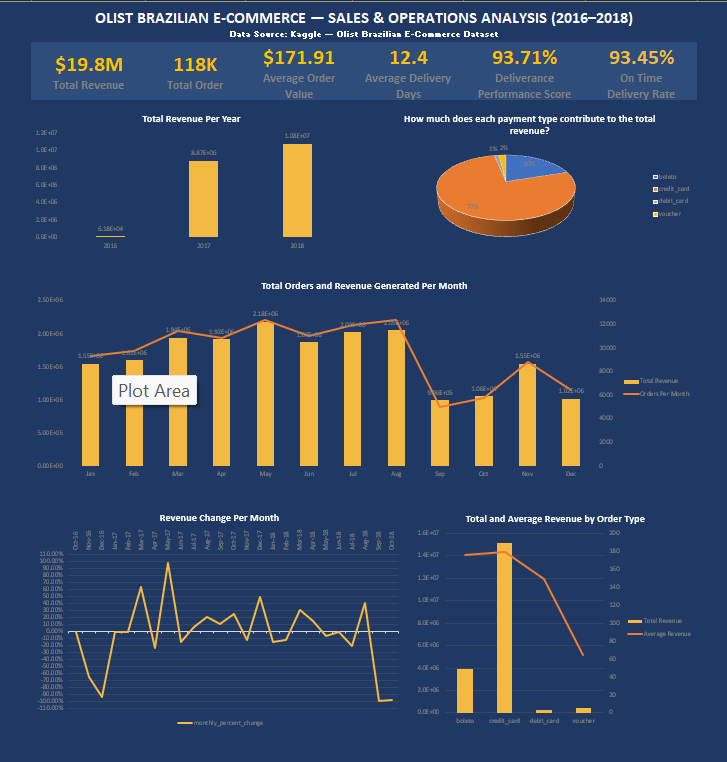

# Excel Projects

# Olist Brazilian E-Commerce — Sales & Operations Analysis (2016–2018)

## Project Overview
This project analyses over 100,000 orders from the Olist Brazilian E-Commerce platform covering the period 2016 to 2018. The analysis explores sales performance, how well orders were fulfilled, payment behaviour, and delivery operations to provide practiceable business insights. All analysis was performed in Microsoft Excel. Power Query was used to merge and transform the data, while Pivot Tables were used for aggregation. This was then used to produce a dynamic dashboard for visual reporting.

## Dataset
- **Source:** [Kaggle — Olist Brazilian E-Commerce Dataset](https://www.kaggle.com/datasets/olistbr/brazilian-ecommerce)
- **Size:** 100,000+ orders across 2016–2018
- **Tables Used:** Orders, Order Items, Order Payments

## Files

| File | Description | Link |
|---|---|---|
| olist_sales_analysis.xlsx | Dashboard and working data | [Download](./olist_sales_analysis.xlsx) |
| Full workbook with analysis | Includes all Pivot Tables and analysis sheets | [View on Google Drive](https://docs.google.com/spreadsheets/d/10zG8pGkC_14pqxOND10ljT0lw6VYv3Hr/edit?usp=drivesdk&ouid=105863017728224190289&rtpof=true&sd=true) |

## Skills Demonstrated
- Data importing and merging across multiple tables using Power Query
- Data cleaning and transformation including date formatting and column standardisation
- Pivot Tables and calculated fields for multi-dimensional aggregation
- Combo charts and dual axis visualisations
- SUMPRODUCT, COUNTIF, COUNTIFS, and AVERAGEIF formulas
- Composite KPI design — Delivery Performance Score combining on-time rate and delivery speed
- Dashboard layout and design with KPI cards and charts.

## Business Questions Answered

### Sales Performance
1. What is the total revenue generated, and how has it trended month by month?
2. Which month had the highest number of orders?
3. What is the average order value?
4. How does revenue compare across different years?

### Order Analysis
5. What is the order status breakdown — how many orders were delivered, cancelled, or in progress?
6. What percentage of orders were successfully delivered?
7. How long does delivery take on average from purchase to delivery?
8. How many orders were delivered late vs on time compared to the estimated delivery date?

### Payment Analysis
9. What is the most popular payment method?
10. What is the average order value by payment method?
11. What percentage of revenue comes from each payment type?

### Freight & Profitability
12. What is the average freight cost per order?
13. What is the ratio of freight cost to product price?
14. How many orders have freight costs higher than the product price?

### Advanced Analysis
15. What is the monthly revenue growth rate — is the business growing or declining?
16. What is the overall Delivery Performance Score combining on-time rate and average delivery speed?

## Key Findings

### Sales Performance
- Total revenue generated across the period was **$19.8M** from **118,000+ orders**
- Average value for an order was **$171.91**
- Monthly revenue showed fluctuation throughout the period without a consistent upward or downward trend. This would suggest that demand was influenced by seasonal patterns and promotional activity rather than steady organic growth
- Peak revenue months were **May and August** while **September, October, and December** recorded the lowest activity. It should however be noted that the full data for October and December in 2018, the year where revenue was highest, are not included in the dataset as deliveries are only covered till the 17th of October.
- 2017 outperformed 2016 overall, consistent with business maturation following the late 2016 launch.
- **2018** was the strongest performing year by total revenue, confirming a year-on-year progress.

### Order Analysis
- **97%** of all orders were successfully delivered
- Average delivery time from purchase to delivery was **12.4 days**
- **93.45%** of delivered orders arrived on or before the estimated delivery date

### Payment Analysis
- The most popular payment method was **credit card**, accounting for **74%** of all orders
- Credit card customers had the highest average order value at **$178.93**
- They also contributed the largest share of total revenue at **77%**

### Freight & Profitability
- Average freight cost per delivered order was **$19.99**
- Freight cost represented an average of **32.32%** of product price per order
- **4377** orders (**0.42%** of total) had freight costs exceeding the product price. Albeit a small percentage, this indicates potential pricing inefficiencies on low-value items

### Delivery Performance
- Delivery Performance Score: **93.71%** — calculated as a weighted composite of on-time delivery rate (60% weight) and normalised delivery speed score (40% weight)
- On Time Delivery Rate: **93.45%**
- Average Delivery Days: **12.4 days**

## Dashboard Preview

## How to Use
- Download the Excel file from the link above or view the full workbook on Google Drive
- Enable editing if prompted on opening
- Navigate to the **Dashboard** sheet first for a high-level overview
- Working data and full analysis including all Pivot Tables are available in the Google Drive version

## Author
**Samuel Aladegbaiye**
