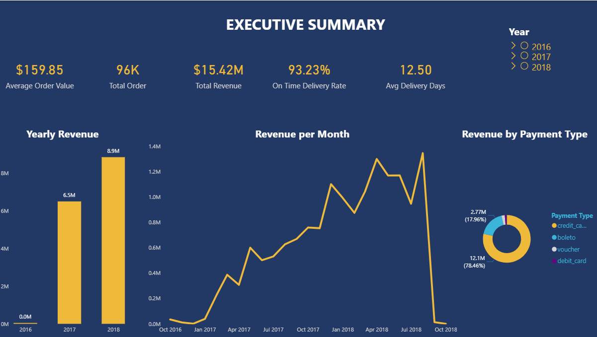
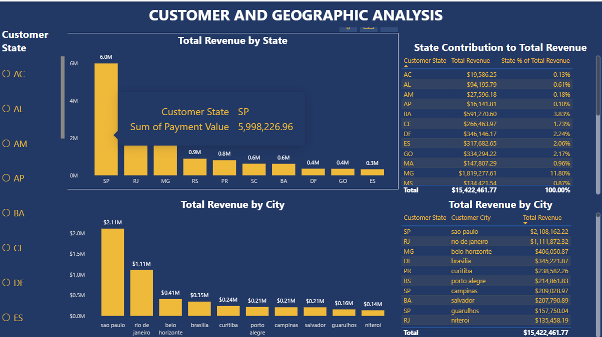
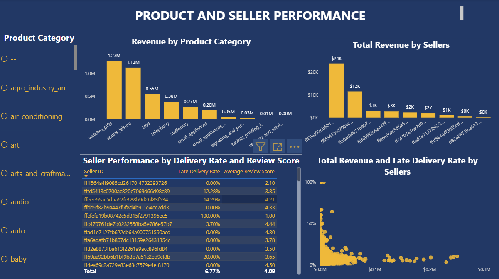
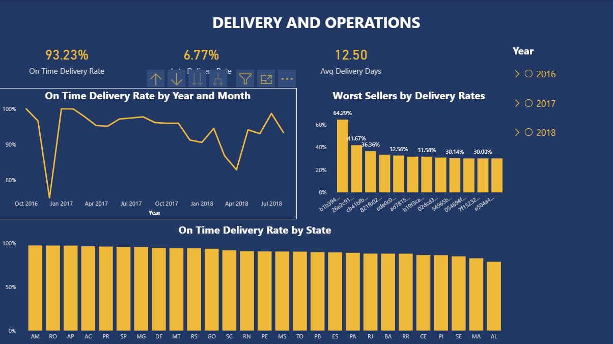

# Olist Brazilian E-Commerce — Power BI Report

## Project Overview
This Power BI report is the third and final phase of the Olist E-Commerce analysis. It adds to the Excel and SQL projects by presenting an interactive, multi-page report built on a star schema data model. It combines DAX measures and Power Query for data transformation and analysis. The report covers sales performance, customer geography, product and seller performance, and delivery operations across 100,000+ orders from 2016 to 2018.

## Files

| File | Description | Link |
|---|---|---|
| olist_powerbi_report.pdf | Full 4-page report exported as PDF | [View](./olist_powerbi_report.pdf) |
| olist_powerbi_report.pbix | Power BI Desktop file | [View on Google Drive](https://drive.google.com/file/d/12n5J1I6BWdu-JXLwpLNHidYtNS1vOCBD/view?usp=drivesdk) |

## Data Model
The report uses a star schema with 9 tables connected through defined relationships:

```
customers ──── customer_id ────> orders
orders ──── order_id ────> order_items
orders ──── order_id ────> order_payments
orders ──── order_id ────> order_reviews
order_items ──── product_id ────> products
order_items ──── seller_id ────> sellers
products ──── product_category_name ────> category_translation
```

These are similar to the foreign key relationships that were defined in the SQL phase, showing consistent data modelling thinking across tools.

## DAX Measures
All measures are stored in the `Measures` table for organisation. Key measures written:

| Measure | Description |
|---|---|
| Total Revenue | CALCULATE with delivered filter — confirmed revenue only |
| Total Orders | DISTINCTCOUNT of order_id for delivered orders |
| Average Order Value | DIVIDE of Total Revenue by Total Orders |
| On Time Delivery Rate | CALCULATE with date comparison filter |
| Late Delivery Rate | Derived from On Time Delivery Rate |
| Avg Delivery Days | AVERAGEX with DATEDIFF per order row |
| Freight to Price Ratio | AVERAGEX ratio of freight to price per order |
| Revenue % of Total | DIVIDE with ALL() to calculate state contribution to grand total |

## Report Pages
### Page 1 — Executive Summary
High level overview of business performance:
- KPI cards: Total Revenue, Total Orders, Average Order Value, Average Delivery Days, On Time Delivery Rate
- Monthly revenue and order count trend (combo chart)
- Revenue by year
- Revenue contribution by payment type
- Year slicer

### Page 2 — Customer & Geographic Analysis
Geographic breakdown of customer behaviour:
- Top 10 states by revenue
- Top 10 cities by revenue
- State revenue contribution table with percentage of total
- State slicer

### Page 3 — Product & Seller Performance
Product category and seller performance analysis:
- Top 10 product categories by revenue
- Top 10 sellers by revenue
- Seller revenue vs late delivery rate scatter plot
- Seller performance table — revenue, late delivery rate, average review score
- Product category slicer

### Page 4 — Delivery & Operations
Operational health and delivery performance:
- KPI cards: On Time Rate, Late Rate, Average Delivery Days
- Delivery performance by state
- Top 10 sellers with highest late delivery rates (minimum 10 orders threshold applied)
- Monthly on time delivery rate trend
- Year slicer

## Skills Demonstrated
- Star schema data modelling with defined relationships
- Power Query data transformation and type management
- DAX measures — CALCULATE, DIVIDE, DISTINCTCOUNT, COUNTROWS, AVERAGEX, DATEDIFF, ALL(), RANKX, VAR/RETURN
- Filter context manipulation with CALCULATE and ALL()
- Dynamic percentage calculations using ALL() for grand total denominator
- Cross-page report design with consistent theming
- Interactive slicers and visual level filters
- Top N filtering with minimum threshold for statistical significance
- Custom theme design — dark navy, gold and teal colour scheme

## Key Findings
### Sales Performance
- Total confirmed revenue: **$15.42M** (delivered orders only)
- Total delivered orders: **96K**
- Average order value: **$159.85**
- Most popular payment method: **credit card** 
- Credit card generated the highest total revenue at **78.46%** of total

### Customer & Geographic
- Top revenue state: **Sao Paulo** contributing **37.41%** of total revenue
- Top revenue city: **Sao Paulo**

### Product & Seller Performance
- Top product category by revenue: **Gift_watches**
- Top seller generated **$24K** in revenue
- Majority of the sellers had above 80% early delivery rate. All the sellers with 100% late deliveries had below 10 orders. The sellers that generated the most revenues, however, had mpressive delivery rates

### Delivery & Operations
- On time delivery rate: **93.23%**
- Average delivery days: **12.5 days**
- **Alagoas** had the highest late delivery rate with **78.59%**
- Sellers with fewer than 10 delivered orders were excluded from late delivery ranking to ensure statistical significance

## Data Note — Cross Tool Validation
During development of this Power BI report, a discrepancy was identified between the Excel revenue figure ($19.8M) and the Power BI figure ($15.42M). Investigation revealed that the Excel working data merged order_items with payments, causing payment values to be duplicated for orders containing multiple items. The correct total delivered revenue is **$15.42M**. This number was comfirmed by both SQL Server and Power BI. This duplication is also reflected in the minor differences in the delivery rate and average nuber of delivery days.

## Report Screenshots

### Page 1 — Executive Summary


### Page 2 — Customer & Geographic Analysis


### Page 3 — Product & Seller Performance


### Page 4 — Delivery & Operations


## How to Access
- View the full report as a PDF using the link above — all 4 pages are included
- Download the .pbix file from Google Drive to interact with the report in Power BI Desktop (free download from Microsoft)
- All slicers and cross-filtering are fully functional in the .pbix file

## Dataset
[Kaggle — Olist Brazilian E-Commerce Dataset](https://www.kaggle.com/datasets/olistbr/brazilian-ecommerce)
