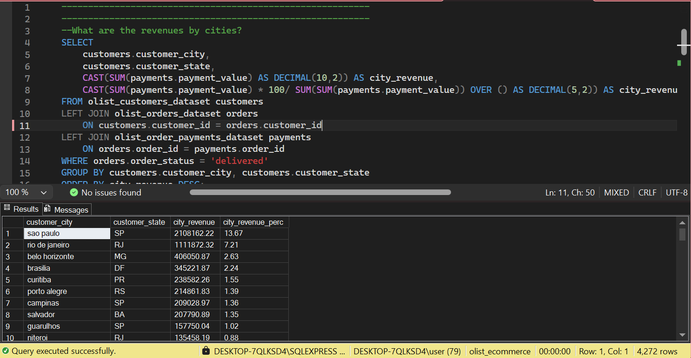
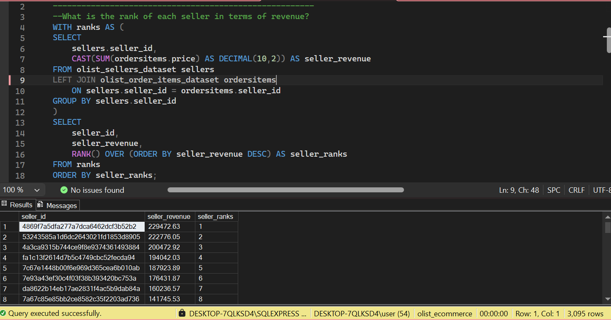
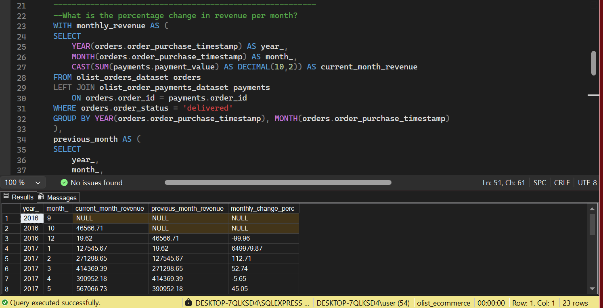
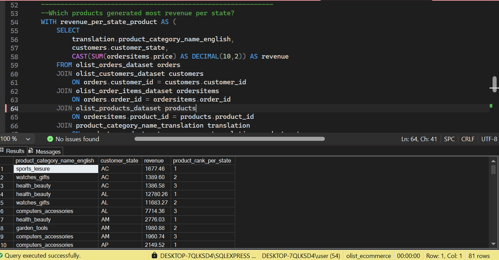

# Olist Brazilian E-Commerce — SQL Analysis

## Overview
Extended analysis of the Olist dataset using SQL Server, 
building on the Excel analysis to incorporate all 9 tables 
across customer, seller, product and operational dimensions.

## Database Setup
- Database: SQL Server (SSMS)
- Tables: 9 tables, 100,000+ orders
- Relationships: Foreign keys defined across all tables
- Data cleaning: Handled orphan categories, null values

## Files
| File | Description |
|---|---|
| 01_setup_relationships.sql | Database creation and Setting Up table relationships|
| 02_eda.sql | Exploratory data analysis |
| 03_customer_analysis.sql | Customer analysis queries |
| 04_seller_analysis.sql | Seller performance queries |
| 05_product_analysis.sql | Product category queries |
| 06_operational_analysis.sql | Operational analysis queries |
| 07_advanced_queries.sql | Window functions and advanced queries |

## Skills Demonstrated
- Database design and relationship definition
- Foreign key constraints
- Data cleaning and orphan record handling
- Complex multi-table JOINs
- CTEs for readable sequential logic
- Window functions — RANK(), LAG()
- Conditional aggregation with SUM(CASE WHEN...)
- DATEDIFF for date arithmetic
- Subqueries and nested logic

## Business Questions Answered

### Customer Analysis
1. Which cities and states generate the most revenue?
2. Average order value by customer state
3. Repeat buyers vs one time buyers

### Seller Analysis
4. Top 10 sellers by revenue
5. Sellers with highest late delivery rates
6. Average review score by seller

### Product Analysis
7. Top product categories by revenue
8. Categories with highest freight to price ratio

### Operational Analysis
9. Average time between purchase and dispatch
10. Sellers with longest dispatch times
11. Delivery performance by state

### Advanced
12. Seller revenue ranking using window functions
13. Month on month revenue growth using LAG
14. Top 5 product categories per state by revenue

## Key Findings
- Sao Pauo was the state with the highest revenue
- It is also the city that generated the most revenue.
- Majority of customers were one-time customers with 5.85% customers patronising more than once
- The top seller generated a revenue of almost $230k
- Health beauty products and gist products were the products that genberated the highest revenue
- Most orders were approved the same day the order was made with an average of 2 days for dispatching after approval.
- Revenue increased over the years, but the month-by-month growth rate was irregular, with no consistent pattern

## Query Screenshots

## Data Cleaning Decisions
- Three product categories missing from translation table were manually inserted with English translations
- 610 null product categories updated to 'uncategorised' and added to translation table
- Foreign key constraints enforced across all 9 tables to guarantee referential integrity

## How to Run
1. Install SQL Server and SSMS
2. Run 01_setup.sql to create the database and set the relationships
3. Import all 9 CSV files using SSMS Import Flat File wizard
4. Run remaining scripts in numbered order

## Dataset
[Kaggle — Olist Brazilian E-Commerce](https://www.kaggle.com/datasets/olistbr/brazilian-ecommerce)
